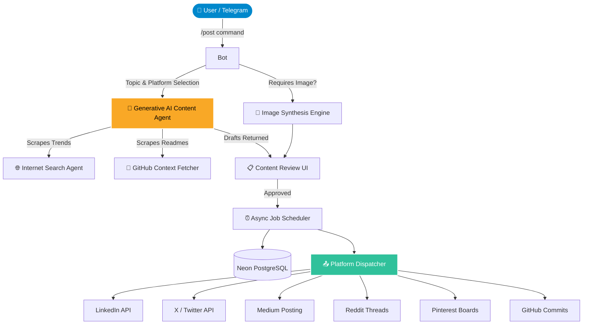

# 🚀 Agentic Social Media System

A fully autonomous, multi-platform social media engine guided by AI. Designed to research trends, formulate high-quality personalized drafts, generate images, and dispatch them seamlessly via a Telegram Bot interface across **LinkedIn, X (Twitter), GitHub, Reddit, Medium, and Pinterest**.

## ✨ Features
- **Agentic Content Construction**: Contextual AI generated content dynamically based off your real GitHub Repos and live Internet Trends.
- **Modular Platform Delivery**: Seamless parsing and formatting adapted for the unique constraints of 6 different ecosystems.
- **Granular Approvals**: Multi-stage approval mechanism built directly into Telegram UI. Independently approve individual platforms. 
- **Advanced Image Synthesis**: Fallback-resilient AI Image Generation utilizing HuggingFace, Pollinations, and Picsum.
- **Termux Native**: Built lightweight to deploy 24/7 on an Android device via Termux entirely for free.

---

## 🗺️ System Architecture



---

## 📊 Technical Complexity Breakdown

| Component | Primary Stack | Complexity | Role |
| :--- | :--- | :--- | :--- |
| **Interface** | `python-telegram-bot` (`v21.6`) | **Medium** | Manages asynchronous conversational states, inline callback keyboards, and payload previews safely wrapping markdown. |
| **Brain** | `google-generativeai` & Prompts | **High** | Evaluates multi-variable persona alignments, enforces word-count constraints (e.g. 5 words max for topic suggestions), and maps internet contexts. |
| **Data Layer** | `asyncpg` + Neon DB | **Low** | Securely maps scheduling states, historical post archives, and state rollbacks. |
| **Dispatcher** | Hand-rolled Handlers | **High** | Uses custom `curl_cffi` requests and strict URI encoding formatting to bypass legacy social platform restrictions (e.g., Medium drafts). |
| **Scheduler** | `APScheduler` | **Medium** | Triggers distributed memory tasks dynamically without causing concurrency deadlocks. |

---

## ⚙️ Core Workflow

1. **Ideation**: You tap *'AI Suggest'*, the `SearchAgent` scrapes the web for the latest Tech/Startup trends, parses your GitHub repos, and returns precisely five 5-word topic suggestions.
2. **Content Generation**: The `ContentAgent` absorbs the persona, generates tailored posts, dynamically attaches your relevant GitHub repository links (`🔗 Source...`), and structures the hashtags.
3. **Quality Gate**: Telegram pushes a combined preview payload containing the rendered AI image and the unescaped markdown text to you.
4. **Independent Approvals**: Utilizing a modular `approved_platforms` state, you validate each platform sequentially. Re-generation or edits untoggles approval to ensure safety.
5. **Dispatch/Schedule**: The post string is sanitized and pushed asynchronously. Platforms lacking direct automated APIs map to a clean Draft callback to securely finalize the publish.

---

## 🚀 Deployment (Termux 24/7 Setup)

Host the bot entirely free in your pocket using Android's Termux shell.

1. **Install Dependencies**: Download Termux via **F-Droid**. 
   ```bash
   pkg update && pkg upgrade -y
   pkg install python git tmux nano -y
   ```
2. **Clone & Setup**:
   ```bash
   git clone https://github.com/ABR-Kapoor/My_SocialMedia_Automation.git
   cd My_SocialMedia_Automation
   pip install -r requirements.txt
   ```
3. **Authenticate Configuration**:
   ```bash
   nano .env
   # Load in GEMINI_API_KEY, TELEGRAM_TOKEN, Postgres DB URI, etc...
   ```
4. **Boot Background Session**: Run it persistently using `tmux` and engage a CPU wakelock to prevent Android from closing it:
   ```bash
   termux-wake-lock
   tmux new -s bot_engine
   python main.py
   ```
5. **Detach**: Press `CTRL + B` then `D`. Your engine runs forever!

*(Detailed Termux instructions are hidden internally but apply to any Debian-based ecosystem!)*

---

## 📈 Future Scope

- [ ] **Omni-Channel Auto-Reply**: Agentic replies to incoming public comments utilizing historic embeddings of the persona.
- [ ] **Shorts Synthesis**: Hooking into video AI pipelines to dynamically render 15-second Reels/Shorts tied to the text context.
- [ ] **Predictive Trend Hijacking**: Continuous background cronjobs that ping Telegram proactively when a massive industry shift occurs to secure first-mover posting advantages.
- [ ] **Telegram Analytics Dashboard**: Rendering historical interaction graphs (likes vs saves) natively within the chat via the `python-telegram-bot` graph modules.

---

**Built by** [ABR-Kapoor](https://github.com/ABR-Kapoor) | *Chanakya × Naval × Agentic AI*
